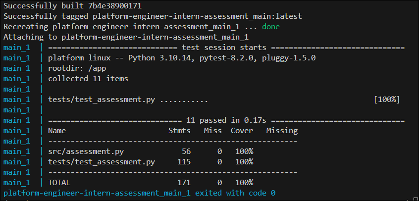

# My Solution of the problem

## Bug

I have already emailed the assingment but I have accidentally mistaken the word "Assessment" with "Assignment", sorry for that.

## How to run project

To run the project run command `docker-compose up --build` in the directory where `Dockerfile` and `docker-compose.yaml` files are located (root directory). In Dockerfile you can comment the line with CMD and uncommect ENTRPOINT to run the tests using docker containers. In case of PermissionError add needed permisions to .pytest_cache (`sudo chmod -R 777 .pytest_cache` works fine).

## Project structure

```
├── docker-compose.yaml               -- docker compose file
├── Dockerfile                        -- dockerfile for the project
├── entrypoint.sh                     -- entrypoint script for running tests inside docker container
├── input.txt                         -- input file from forked project
├── output.txt                        -- output file generated from my solution
├── README.md                         -- README file
├── setup.py                          -- setup file for Python projects to prevent program from relative import etc
├── Solution.md                       -- my description of the solution
├── src                               -- main directory 
│   ├── assessment.py                 -- file with Assessment class with all instructions to solve problem
│   ├── instructions.md               -- file from forked project 
│   └── main.py                       -- executable file for generating solution
├── tests                             -- test directory
│   ├── input.txt                     -- input file from example input in Readme.md
|   └── test_assessment.py            -- file containing all tests  
```

## Workflow of project

I have created a class `Assessment` in `assessment.py` file with all methods. I have tried to follow SOLID, DRY and KIS principles to keep code clean, simple and readable. Everything is described in docstrings. The Proof of Concept looks like this:

- read a line from input.txt file
- remove newline from end of line
- split the line by colon into command and other part of line (let's call it arg)
- based on command I run top command or record command
- if it's record command, then I split the arg by comma and get artist name and name of the song. I add this data to a map: map[artist_name][song_name] = number of song records (initially 0), and if the song is being played again I increase the number by one. At the same time I update another map which tracks the current most played song of every artist. If the map[artist_name][song_name] is greater than most_played_song[artist_name] then I update the most_played_song dict.
- if it's top command, the arg is actual artist name so I just get the value from most_played_song[artist_name], add it to `output.txt` and print it on the screen. Sometimes top command are executed on artists which has not recorded any song yet. At that case I write "NO RECORDS YET" instead of actual song name.

## Docker

I created a dockerfile which create an image of the project. It installs pytest and coverage as only non-standard libraries and setup docker container. I know that tests shouldn't be in docker containers, but I didn't want to force you to install venv or anything else. My progrmm automatically generates output.txt file in root directory, but to manage that in docker I had to add docker compose file to add volume (it's more comfortable to run docker compose up than adding flags in docker run).
Dockerfile by default runs `main.py` but if you comment line with `CMD` and uncomment `ENTRYPOINT` you will be able to run tests inside docker with auto-generated coverage report.

## Tests

Tests are built with `pytest` and `unittests` library. I also installed `coverage` to check program coverage and its result are shown on image below.



## Time complexity

The file `input.txt` is read line by line. The record commands use dictionaries as data structure to keep track of number of records of songs. Since adding and getting data from dictionaries is `O(1)` time complexity the record command has also `O(1)` complexity. Updating the most played song is also `O(1)` complexity.

The top command is just a getter from a most played song dictionary so its time complexity is also `O(1)`.

We have `n` lines in file, each line is executable in `O(1)` time complexity, so the final sum is `O(N)` [linear] time complexity.
